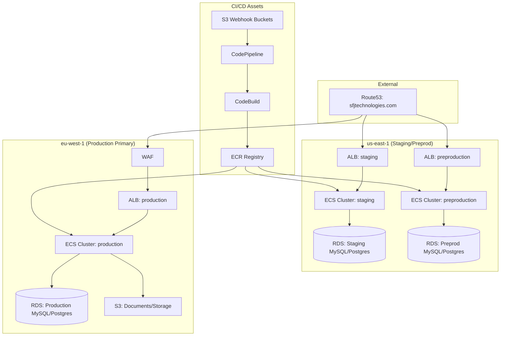

# AWS Infrastructure Inventory: SFJ Backend / Lemon Alerts

## Executive Summary
This document provides a comprehensive analysis of the AWS environment for the **SFJ Backend / Lemon Alerts** project (Account ID: `910976932103`).

**Key Environments:**
*   **Staging:** Located in `us-east-1`.
*   **Preproduction:** Located in `us-east-1`.
*   **Production (Primary):** Located in `eu-west-1` (Ireland).
*   **Production (Auxiliary/Regional):** Presence in `eu-west-3` (Paris).

---

## 1. Networking Topology

### Regional Distribution
| Region | Environment | VPC ID | CIDR |
| :--- | :--- | :--- | :--- |
| `us-east-1` | Staging | `vpc-0a3e77bc0b7cfd3b3` | `10.10.0.0/16` |
| `us-east-1` | Preproduction | `vpc-0a50f7b606f7fe477` | `10.10.0.0/16` |
| `eu-west-1` | Production | `vpc-04d5d18ce0fe24074` | `10.10.0.0/16` |
| `us-east-1` | Legacy/Aux Prod | `vpc-09ea3e727ed1d5a4e` | `10.10.0.0/16` |

> [!NOTE]
> All primary VPCs use the same `10.10.0.0/16` CIDR block, suggesting they were created from a common template but remain isolated.

---

## 2. Compute & Orchestration (ECS)

Each environment runs a standardized stack on ECS (EC2 launch type) with the following components:

### Staging (`us-east-1`)
*   **Cluster:** `staging`
*   **Services:**
    *   `staging-backend-app`: Django web application (Port 8000).
    *   `staging-backend-worker`: Celery worker for async tasks.
    *   `staging-backend-beat`: Celery scheduler.
    *   `staging-sfj-api-app`: Primary API service.
    *   `staging-sfj-api-otel`: OpenTelemetry Sidecar for observability.

### Preproduction (`us-east-1`)
*   **Cluster:** `preproduction`
*   **Services:** Mirror of Staging (`preproduction-backend-app`, etc.).

### Production (`eu-west-1`)
*   **Cluster:** `production`
*   **Services:**
    *   `production-backend`: Primary backend API.
    *   `production-backend-worker` / `beat`.
    *   `production-sfj-api`.
    *   `aws-waf-logs-backend-ireland`: WAF integration active.

---

## 3. Storage & Databases

### Relational Databases (RDS)
| Environment | Backend DB (Aurora MySQL) | API DB (PostgreSQL) |
| :--- | :--- | :--- |
| **Staging** | `staging-backend-encrypted` | `staging-sfj-api` |
| **Preproduction** | `preproduction-backend-encrypted` | `preproduction-sfj-api` |
| **Production** | `production-backend-encrypted` | `production-sfj-api` |

### General Storage (S3)
*   **Artifacts:** `codepipeline-api-910976932103`, `codepipeline-artifacts-us-east-1-910976932103`.
*   **App Data:** `sfj-documents`, `private-company-files`, `sfj-storage`.
*   **Logs/Archive:** `sfj-log-archive-eu-west-1`, `sfj-alert-archive-eu-west-1`.

---

## 4. CI/CD & Deployment Flow
The deployment follows a sophisticated **S3 Webhook -> Pipeline** pattern.

1.  **Source:** Zip files uploaded to environment-specific S3 buckets (e.g., `front-prod-webhook-outputbucket-17ydg07hs9rrw`).
2.  **Trigger:** EventBridge rules monitor these uploads (e.g., `codepipeline-65817815-frontprodwebhookoutputbucketydghsrrw-rule`).
3.  **Pipeline:** CodePipeline triggers CodeBuild projects (e.g., `staging-backend`, `production-sfj-api`).
4.  **Registry:** Images are stored in environment-prefixed ECR repositories.
5.  **Deploy:** CodePipeline updates the corresponding ECS Service.

---

## 5. Security & Governance

### Secrets & Parameters
*   **Secrets Manager:** Hierarchical naming (`production/backend`, `staging/sfj-api`).
*   **SSM Parameter Store:** Extensive use for app config (`/ECS-CLUSTER/prod/EMAIL_HOST`, `/API_MONITOR/staging/ENDPOINT_URL`).
*   **AI Integration:** API Keys for OpenAI and Perplexity are managed in SSM.

### Governance
*   **GuardDuty:** Malware protection active for production data buckets in Ireland.
*   **AWS Config:** Conformance packs found for ECS, S3, and IAM security pillars.
*   **WAF:** Protecting the Ireland production ALB (`aws-waf-logs-backend-ireland`).

---

## 6. Identified Risks & Observations
*   **CIDR Overlap:** While technically safe in isolated VPCs, it can complicate future VPC Peering or Transit Gateway integrations.
*   **Regional Fragmentation:** The presence of `eu-west-3` resources might indicate regional failover OR a "shadow" production environment that needs audit.
*   **Disabled Scalability:** `ScaleUp` and `ScaleDown` EventBridge rules are currently **DISABLED**, suggesting manual scaling or costs-saving measures in place.
*   **CloudFormation Drift:** Several core stacks (e.g., `staging-cluster-elb`) show **DRIFTED** or **UPDATE_ROLLBACK_COMPLETE** status, requiring reconciliation.
